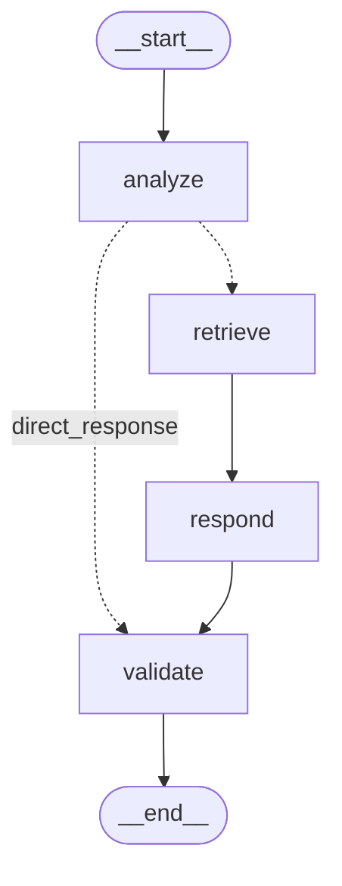

# SHL Assessment Recommender

A conversational AI agent that recommends SHL assessments to hiring managers through a multi-turn dialogue interface. Built with **LangGraph**, **FAISS**, and **Gemini 2.5 Flash Lite**.

## Architecture



The agent is a **4-node LangGraph state machine** with conditional routing. After the `analyze` node classifies user intent, it either takes the **direct response** path (for `clarify`, `refuse`, `confirm`) or the **retrieval path** (for `recommend`, `refine`, `compare`) through `retrieve → respond → validate`.

1. **Analyze & Route** — Classifies user intent (`clarify`, `recommend`, `refine`, `compare`, `refuse`, `confirm`) and extracts structured context (role, seniority, skills).
2. **Retrieve** — Performs semantic search over the 377-item SHL catalog using FAISS with `all-MiniLM-L6-v2` embeddings. Retrieves top-20 candidates for the LLM to reason over.
3. **Generate Response** — Sends conversation history + retrieved candidates to Gemini 2.5 Flash Lite, which selects the best 1–10 assessments and generates a natural language explanation.
4. **Validate & Format** — Cross-references every recommendation against the source catalog JSON. Drops any hallucinated URLs or malformed entries before returning.

## API Endpoints

| Method | Path | Description |
|--------|------|-------------|
| `GET` | `/health` | Returns `{"status": "ok"}` with HTTP 200 |
| `POST` | `/chat` | Stateless conversation endpoint |

### POST /chat

**Request:**
```json
{
  "messages": [
    {"role": "user", "content": "I need to assess Java developers"}
  ]
}
```

**Response:**
```json
{
  "reply": "Here are my recommendations for Java developers...",
  "recommendations": [
    {
      "name": "Core Java (Advanced Level) (New)",
      "url": "https://www.shl.com/products/product-catalog/view/core-java-advanced-level-new/",
      "test_type": "K"
    }
  ],
  "end_of_conversation": false
}
```

## Project Structure

```
├── app/
│   ├── main.py          # FastAPI application & endpoints
│   ├── agent.py         # LangGraph agent pipeline (4 nodes)
│   ├── catalog.py       # CatalogManager — loads & validates catalog
│   ├── retrieval.py     # FAISS-based semantic retrieval
│   ├── prompts.py       # All LLM prompt templates
│   └── schemas.py       # Pydantic request/response models
├── data/
│   ├── shl_product_catalog.json   # 377-item SHL assessment catalog
│   └── faiss_index/               # Pre-built FAISS vector index
├── scripts/
│   └── build_index.py   # Script to rebuild FAISS index
├── tests/               # Unit tests for catalog, retrieval, agent
├── Dockerfile           # Production Docker image
└── requirements.txt
```

## Setup

### Local Development

```bash
# Clone the repository
git clone https://github.com/yourusername/shl-assessment-recommender.git
cd shl-assessment-recommender

# Create virtual environment
python -m venv .venv
source .venv/bin/activate

# Install dependencies
pip install -r requirements.txt

# Set environment variables
echo "GOOGLE_API_KEY=your_gemini_api_key" > .env

# Run the server
uvicorn app.main:app --reload
```

### Docker

```bash
docker build -t shl-recommender .
docker run -e GOOGLE_API_KEY=your_key -p 8000:8000 shl-recommender
```

## Key Design Decisions

- **Stateless API**: The API is fully stateless — the client sends the entire conversation history on each call. The agent reconstructs its previous recommendation state by parsing its own prior messages.
- **Hybrid Retrieval**: FAISS semantic search retrieves 20 candidates; the LLM then reasons over them to select the best 1–10. This two-stage approach balances recall with precision.
- **Anti-Hallucination**: Every recommendation is cross-validated against the source catalog JSON before being returned. If the LLM invents a product name, it is silently dropped.
- **Turn Cap Enforcement**: The agent forces `end_of_conversation: true` at the 4th user turn (8th total message) to comply with the evaluator's strict turn limit.

## Tech Stack

| Component | Technology |
|-----------|-----------|
| LLM | Gemini 2.5 Flash Lite |
| Embeddings | all-MiniLM-L6-v2 (sentence-transformers) |
| Vector Store | FAISS |
| Orchestration | LangGraph |
| API Framework | FastAPI |
| Validation | Pydantic v2 |
